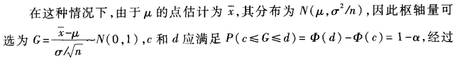
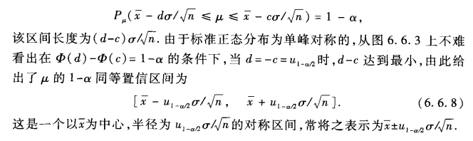
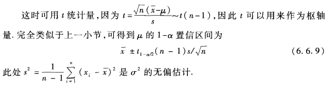
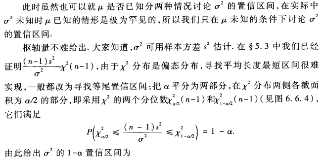
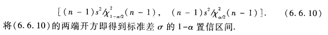

## coding笔记

### 语言分类：强弱、动态及静态

1. Program errors: 
	* trapped errors: 程序终止；除以0，java的数组越界；
	* untrapped errors: 出错后继续执行；如C语言中的缓存区溢出，jump到错误地址。

2. Forbidden behavior: 必须包含所有untrapped error，包含部分trapped error。

3. Well behaved: 程序执行不可能出现forbidden behaviors；与之相对的有，Ill behaved。

5. 强类型（strongly）：所有程序均well behaved；否则为weakly typed。比如C语言的缓冲区溢出，属于trapped errors，即属于forbidden behavior，故C是弱类型。

6. 静态类型 statically: 如果在编译时拒绝ill behaved程序，则是statically typed;
动态类型dynamiclly: 如果在运行时拒绝ill behaviors, 则是dynamiclly typed。

7. 具体列表：
	* 无类型： 汇编
	* 弱类型、静态类型 ： C/C++
	* 弱类型、动态类型检查： Perl/PHP
	* 强类型、静态类型检查 ：Java/C#
	* 强类型、动态类型检查 ：Python, Scheme
	* 静态显式类型 ：Java/C
	* 静态隐式类型 ：Ocaml, Haskell

	
### Java数据抽象
1. 抽象数据类型 和 静态方法库
2. 对象：
	* 状态（数据类型中的值）
	* 标志（将一个对象区别于另一个，相当于内存中的位置）
	* 行为（对数据类型的操作）
	
	引用：访问对象的一种方式，可以认为就是内存地址。
	
### 生存分析 与 Kaplan-Meier 估算子

### 正态分布的置信区间
* （1）sigma已知时mu的置信区间
	mu的点估计为样本x的平均值，分布为 N(<x>, sigma^2/n) (中心极限定理)
	
	易知：
	
* （2）sigma未知时mu的置信区间
	
* （3）sigma的置信区间
	
	
	
